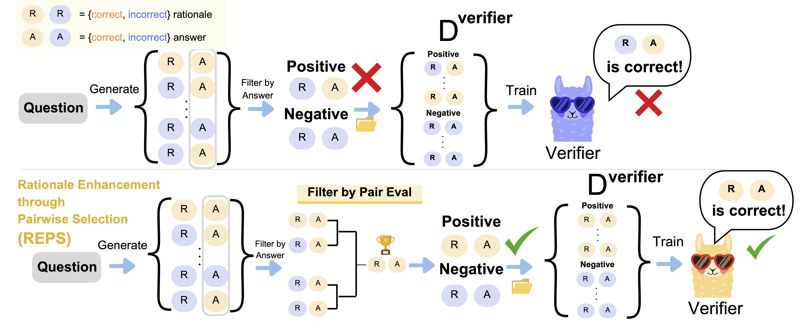

# Rationale-Aware Answer Verification by Pairwise Self-Evaluation

This repository provides the **official implementation** of **Rationale Enhancement through Pairwise Selection (REPS)** proposed in the paper:

**[Rationale-Aware Answer Verification by Pairwise Self-Evaluation](https://aclanthology.org/2024.emnlp-main.905/) (accepted to EMNLP 2024)**  
by Akira Kawabata and Saku Sugawara

## Overview

**REPS** aims to train a verifier (outcome reward model) that not only checks whether the final answer is correct, but also **ensures the reasoning (rationale) behind the answer is sound**.  
To train such a rationale-aware verifier, REPS constructs a high-quality reward dataset by using a tournament-style pairwise self-evaluation to select the single most valid solution (both final answer and rationale). We then train the verifier with these refined "chosen" samples.

<div align="center">
  
</div>

```bibtex
@inproceedings{kawabata-sugawara-2024-rationale,
    title = "Rationale-Aware Answer Verification by Pairwise Self-Evaluation",
    author = "Akira Kawabata and Saku Sugawara",
    booktitle = "Proceedings of the 2024 Conference on Empirical Methods in Natural Language Processing",
    year = "2024",
    publisher = "Association for Computational Linguistics",
}
```

## Contents

1. [Installation](#installation)
2. [Quick Start](#quick-start)
3. [Data Preparation](#data-preparation)
4. [Running REPS](#running-reps)
5. [Reward Model Training](#reward-model-training)
6. [Evaluation](#evaluation)
7. [FAQ](#faq)
8. [Contact](#contact)

---

## Installation

We recommend using [Poetry](https://python-poetry.org/). For Poetry:

```bash
git clone https://github.com/AkiraKawabata/REPS.git
cd REPS
poetry install
```

---

## Quick Start

Below is a minimal example to:

1. Generate multiple Chain-of-Thought solutions (CoT) for a given dataset (e.g., ARC).  
2. Run the self-evaluation (pairwise tournaments) to pick the best-justified solutions.  
3. Train a reward model (verifier) that recognizes well-justified solutions.

### 1) Generate Chain-of-Thought (CoT) Explanations

Run:
```bash
sh src/scripts/run_cot.sh arc
```
This calls `cot_generation.py` to sample multiple solutions for each question in ARC. A JSONL file (e.g., `output/arc_cot_results.jsonl`) will be created, containing each question, gold answer, and N solutions with final answers and rationales.

### 2) Self-Evaluation (REPS)

Then run:
```bash
sh src/scripts/run_self_eval.sh output/arc_cot_results.jsonl arc
```
This uses `reps.py` to select the most valid solution among correct-answer candidates by pairwise comparison. It outputs a file like `output/arc_cot_results_evaluated_results.jsonl`, which includes the best solution (`best_explanation`) per question.

### 3) Train a Reward Model

Finally, train a reward model (verifier) using the chosen solutions vs. random incorrect solutions:

```bash
sh src/scripts/run_reward_model.sh \
  output/arc_cot_results_evaluated_results.jsonl \
  config/model_config.yaml
```

The trained model is saved to `output/reward_model`.

---

## Data Preparation

We provide scripts for ARC, DROP, and StrategyQA. Each script fetches or loads a subset from Hugging Face Datasets or local JSON.  

- **ARC**: `allenai/ai2_arc`  
- **DROP**: `ucinlp/drop`  
- **StrategyQA**: requires a local JSON file with yes/no labels  

You can adjust paths or configs in `src/config/datasets/`.

---

## Running REPS

`REPS` is essentially implemented in `reps.py` via:

1. Filtering out any candidates with incorrect final answers.  
2. Performing single-elimination tournaments for the remaining N correct candidates.  
3. Each match calls LLM-based pairwise evaluation multiple times (majority vote) to decide a winner.  

Key parameters:
- `N`: The number of correct solutions to consider in each tournament.
- `S`: The number of pairwise comparisons for each match.

To change them, edit `self_eval` in `config/model_config.yaml`.

**Example**:

```yaml
self_eval:
  S: 5
  N: 8 
```

---

## Reward Model Training

The reward model is a standard sequence classification model (e.g., HF `AutoModelForSequenceClassification`) that learns to evaluate a solution. Steps:

1. **Prepare Training Data**: `reward_training.py` reads the self-evaluation output.  
   - Positive samples: chosen solutions with correct rationales.  
   - Negative samples: randomly sampled incorrect solutions.  
2. **Train**: Minimizes a reward loss so that chosen > rejected.  
3. **Save**: A trained checkpoint (e.g., `output/reward_model`) for scoring solutions at inference.

**Sample command**:
```bash
sh src/scripts/run_reward_model.sh \
  output/arc_cot_results_evaluated_results.jsonl \
  config/model_config.yaml
```

---

## Evaluation

For rationale-level evaluation, we provide `eval.py`.  
**Usage**:
```bash
sh src/scripts/run_eval.sh arc output/reward_model data/eval_data 8
```
It loads a dataset (e.g., `eval_data/eval_arc.jsonl`) with labeled rationales (valid or invalid) and measures the verifier's ability to pick the best rationale among multiple candidates.

- `--dataset` can be `arc`, `drop`, or `strategy_qa`.  
- `--model_path` points to the trained reward model.  
- `--eval_data_dir` is the path to your test JSONL.  
- `--batch_size` is optional (defaults to 8).

---

## FAQ
- **Q**: Does REPS require human annotation?  
  - **A**: No. The LLM itself compares rationales, so no additional human-verified rationales are needed.  

---

## Contact

For questions or issues, please open a GitHub Issue or contact the authors:

Akira Kawabata (kawabata-a [at] asahi.com or kwbt0206 [at] gmail.com)